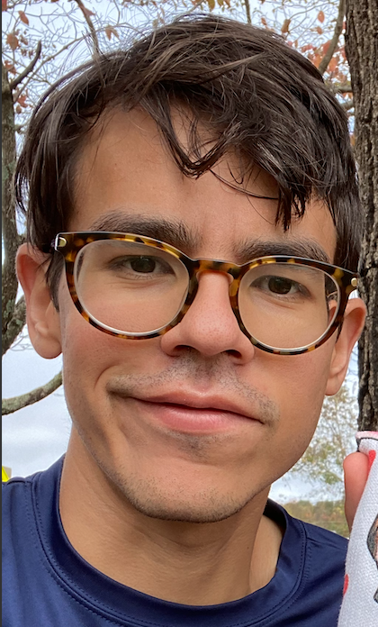

---
# Feel free to add content and custom Front Matter to this file.
# To modify the layout, see https://jekyllrb.com/docs/themes/#overriding-theme-defaults
# title: Home
layout: home
---
<h1>Home</h1>

Welcome to my webpage! I am a Computer Engineering M.S. student at the University of Virginia. My work primarily lies in <b>cybersecurity</b> and <b>systems security</b>. Keep reading to learn more about some projects I have worked on in the past. I am currently being advised by <a href="https://engineering.virginia.edu/faculty/yixin-sun">Yixin Sun</a>.

<h2>Education</h2>

University of Virginia - <b>Master of Science</b> <i>(Aug 2019 - May 2021)</i>  
University of Virginia - <b>Bachelor of Science with High Distinction</b> <i>(Aug 2013 - May 2017)</i> 

<h2>Research</h2>
<b>Traffic Analysis on Tor and LTE/4G</b> 
<i>(Jun 2020 - present)</i>

Working with <a href="http://www.people.virginia.edu/~cs7dt/home.html">Cong Shen</a> and Yixin on a project that aims to perform traffic analysis on the Tor network and layer-2 LTE packets. In our simulation, we use <a href="https://shadow.github.io/">shadow</a> for the Tor componenet, and <a href="https://www.nsnam.org/">ns3</a> for the LTE side. We are on track to perform tests on a physical testbed in the Spring of 2021. 

<b>Program segmentation based on framework APIs</b> <i>(Oct 2019 - Jun 2020)</i>

I worked on a C++ system whose goal was to delegate the execution of a given framework API to a subprocess, reducing the attack surface of framework exploits. The delegating program would pass all the necessary data to the other processes through IPC using shared memory.

 <!--span style="position:absolute; right:1px; top:225px">A picture of yours truly.-->

 

<h2 style="clear:left">Work</h2>

 <b>Goldman Sachs </b> <i>(Sep 2017 - July 2019)</i>

After undergrad, I spent 2 years working at Goldman Sachs as a Technology Analyst. I was part of the Workflow team, who managed various business processes in the firm through <a href="https://en.wikipedia.org/wiki/Business_Process_Model_and_Notation">BPMNs</a>. My responsibilities were those of an SRE (site-reliability engineer), trying to solve incidents when they arised, and reducing <a href="https://landing.google.com/sre/sre-book/chapters/eliminating-toil/">toil</a> everywhery as needed. 

<h2>Teaching</h2>

I have lots of experience being a Teacher Assistant! Let me know if you looking for one.

<b>ECE/CS 6501 Matrix Analysis</b> with Cong Shen <i>(Fall 2020)</i>  
<b>ECE 2660 Fundamentals of Electrical Engineering II</b> with Todd Delong <i>(Fall 2019)</i>  
<b>CS 4630 Defense Against the Dark Arts</b> with Charles Reiss <i>(Spring 2017)</i>  
<b>CS 4630 Defense Against the Dark Arts</b> with Wei Wang <i>(Spring 2016)</i>  
<b>ECE 2630 Fundamentals of Electrical Engineering I</b> with Robert Weikle <i>(Spring 2015)</i>  

